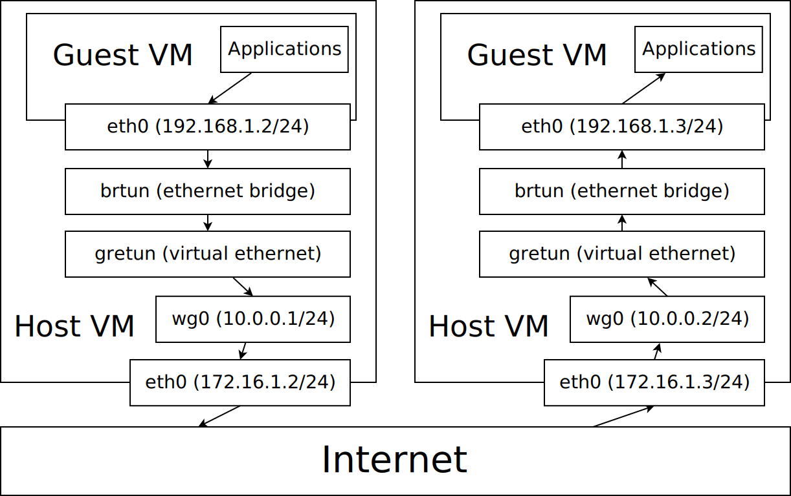

# Butter Cloud

A basic cloud provider focused on ease of use above all else.

## Status

This README is just describing what the project goals are, nothing is really
implemented yet.

## Goal

To make it easy to take a set of normal personal machines on any network and
convert them into a "cloud" with an API that allows dynamic creation of private
networks and virtual machines on demand.

This is similar in spirit to https://www.openstack.org/, but is an experiment to
see what happens if we are willing to sacrifice everything else (besides
security and safety) for simplicity ease of use above all else.

For example, if there is a way to improve performance, but it makes things
harder to understand or use, then the idea is to ignore that and keep it simple.
Maybe this can become a good teaching tool, but also it can be a test to see how
far we can take that idea.

## Implementation

The definition of "cloud" here is purposely limited to just creating private
networks and virtual machines.

For the private networks, the idea is to use wireguard to create a VPN, and then
have all the guest VMs join that VPN. Specifically, this will mean tunneling
something that can operate at layer 2 and be connected to the guest VMs through
wireguard. See [this
post](https://www.reddit.com/r/WireGuard/comments/m52d1j/wireguard_layer_2_bridge_gretap_or_vxlan/).

For VMs, anything that makes it easy at first would be good, probably backed by
[libvirt](https://libvirt.org/).

So far, a proof of concept has been done with gretun, wireguard, and vagrant
running libvirt. See this diagram:

- `eth0` (guest) is the only interface the guest VM sees. The proof of concept
  uses
  [vagrant](https://developer.hashicorp.com/vagrant/docs/networking/private_network).
- `brtun` is an ethernet bridge, which can be used to put two ethernet devices
  on the same network. See [this
  paper](https://wiki.aalto.fi/download/attachments/70789083/linux_bridging_final.pdf).
- `gretun` is a virtual ethernet device created using [Generic Routing
  Encapsulation](https://david-waiting.medium.com/a-beginners-guide-to-generic-routing-encapsulation-fb2b4fb63abb).
- `wg0` is the [wireguard VPN](https://www.wireguard.com/) interface that
  encrypts traffic to the other end of the connection.
- `eth0` (host) is the ethernet device on the host that is actually connected to
  the internet.

The end result of all this is that the ethernet device on the guest is "plugged
in" to the ethernet bridge `brtun`, and `gretun` is also plugged into that
bridge. Since `gretun` is just an ethernet device, the connection from one end
to the other is similar to just having an ethernet cable between the two hosts.
However, instead of an ethernet cable, this is a virtual ethernet device that
uses `wg0` to send packets to the other end. `wg0` in turn, is a VPN interface
rather than a normal network interface, that encrypts the packets before sending
them on the way over the host ethernet interface out to the internet.

Then, the packets are recieved on the other side, and the whole process is
reversed.
